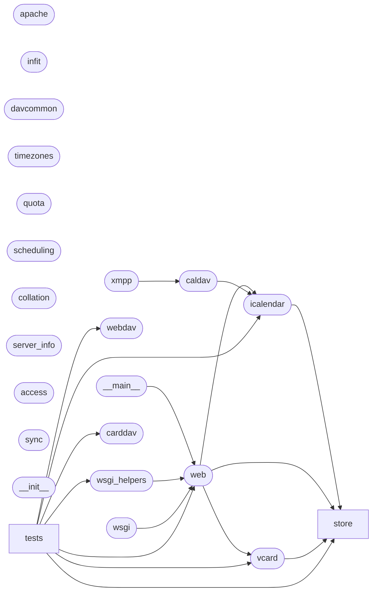

# Code Overview

[_Documentation generated by Documatic_](https://www.documatic.com)

<!---Documatic-section-Codebase Structure Python-start--->
## Codebase Structure Python

The codebase has a single-depth folder structure,
                with 37 code files in total.

<!---Documatic-block-system_architecture-start--->

<!---Documatic-block-system_architecture-end--->

# #
<!---Documatic-section-Codebase Structure Python-end--->

<!---Documatic-section-Important Functions-start--->
## Important Functions

<!---Documatic-block-important_funcs-start--->
<!---Documatic-block-most_used_funcs-start--->
### Most Utilised Functions

* [xandikos.icalendar.apply_time_range_vevent](5-xandikos_icalendar.md#xandikos.icalendar.apply_time_range_vevent) (2 times)
* [xandikos.icalendar.as_tz_aware_ts](5-xandikos_icalendar.md#xandikos.icalendar.as_tz_aware_ts) (2 times)
* [xandikos.store.__init__.open_by_content_type](7-xandikos_store.md#xandikos.store.__init__.open_by_content_type) (2 times)
* [xandikos.store.__init__.open_by_extension](7-xandikos_store.md#xandikos.store.__init__.open_by_extension) (2 times)
* [xandikos.web.main](6-xandikos_web.md#xandikos.web.main) (1 times)
* [xandikos.icalendar.expand_calendar_rrule](5-xandikos_icalendar.md#xandikos.icalendar.expand_calendar_rrule) (1 times)
* [xandikos.carddav.apply_filter](4-xandikos_carddav.md#xandikos.carddav.apply_filter) (1 times)
* [xandikos.icalendar.validate_calendar](5-xandikos_icalendar.md#xandikos.icalendar.validate_calendar) (1 times)
<!---Documatic-block-most_used_funcs-end--->

<!---Documatic-block-end_user_funcs-start--->
### End User Exposed Functions

* [xandikos.web.main](6-xandikos_web.md#xandikos.web.main)
* xandikos.__main__.main
<!---Documatic-block-end_user_funcs-end--->
<!---Documatic-block-important_funcs-end--->

# #
<!---Documatic-section-Important Functions-end--->

<!---Documatic-section-File IO-start--->
## File IO

<!---Documatic-block-file_io-start--->
The following files have file read operations

<!---Documatic-block-xandikos-start--->

	
<code>xandikos</code> (Click to Expand!)

* xandikos.web

<!---Documatic-block-xandikos-end--->

<!---Documatic-block-xandikos.store-start--->

	
<code>xandikos.store</code> (Click to Expand!)

* xandikos.store.git
* xandikos.store.vdir

<!---Documatic-block-xandikos.store-end--->

The following files have file write operations

<!---Documatic-block-xandikos-start--->

	
<code>xandikos</code> (Click to Expand!)

* xandikos.web

<!---Documatic-block-xandikos-end--->

<!---Documatic-block-xandikos.store-start--->

	
<code>xandikos.store</code> (Click to Expand!)

* xandikos.store.git
* xandikos.store.vdir

<!---Documatic-block-xandikos.store-end--->

<!---Documatic-block-xandikos.tests-start--->

	
<code>xandikos.tests</code> (Click to Expand!)

* xandikos.tests.test_store

<!---Documatic-block-xandikos.tests-end--->
<!---Documatic-block-file_io-end--->

# #
<!---Documatic-section-File IO-end--->

<!---Documatic-section-Class Hierarchy-start--->
## Class Hierarchy

<!---Documatic-block-StoreBasedCollection-start--->

	
<code>StoreBasedCollection</code> (Click to Expand!)

* xandikos.web.AddressbookCollection
* xandikos.web.CalendarCollection
* xandikos.web.ScheduleInbox
* xandikos.web.ScheduleOutbox

<!---Documatic-block-StoreBasedCollection-end--->

<!---Documatic-block-webdav.Collection-start--->

	
<code>webdav.Collection</code> (Click to Expand!)

* xandikos.caldav.Calendar
* xandikos.carddav.Addressbook
* xandikos.scheduling.ScheduleInbox
* xandikos.scheduling.ScheduleOutbox
* xandikos.web.CollectionSetResource

<!---Documatic-block-webdav.Collection-end--->

<!---Documatic-block-xandikos.apache.ExecutableProperty-start--->

	
<code>xandikos.apache.ExecutableProperty</code> (Click to Expand!)

* xandikos.webdav.AddMemberProperty
* xandikos.webdav.CommentProperty
* xandikos.webdav.CreationDateProperty
* xandikos.webdav.CurrentUserPrincipalProperty
* xandikos.webdav.DisplayNameProperty
* xandikos.webdav.GetCTagProperty
* xandikos.webdav.GetContentLanguageProperty
* xandikos.webdav.GetContentLengthProperty
* xandikos.webdav.GetContentTypeProperty
* xandikos.webdav.GetETagProperty
* xandikos.webdav.GetLastModifiedProperty
* xandikos.webdav.LockDiscoveryProperty
* xandikos.webdav.PrincipalURLProperty
* xandikos.webdav.RefreshRateProperty
* xandikos.webdav.ResourceTypeProperty
* xandikos.webdav.SupportedLockProperty
* xandikos.webdav.SupportedReportSetProperty

<!---Documatic-block-xandikos.apache.ExecutableProperty-end--->

<!---Documatic-block-xandikos.web.ObjectResource-start--->

	
<code>xandikos.web.ObjectResource</code> (Click to Expand!)

* xandikos.webdav.Collection
* xandikos.webdav.Principal

<!---Documatic-block-xandikos.web.ObjectResource-end--->

<!---Documatic-block-xandikos.webdav.Collection-start--->

	
<code>xandikos.webdav.Collection</code> (Click to Expand!)

* xandikos.caldav.Calendar
* xandikos.carddav.Addressbook
* xandikos.scheduling.ScheduleInbox
* xandikos.scheduling.ScheduleOutbox
* xandikos.web.Collection
* xandikos.web.CollectionSetResource
* xandikos.web.PrincipalCollection

<!---Documatic-block-xandikos.webdav.Collection-end--->

<!---Documatic-block-xandikos.webdav.DeleteMethod-start--->

	
<code>xandikos.webdav.DeleteMethod</code> (Click to Expand!)

* xandikos.webdav.DeleteMethod
* xandikos.webdav.GetMethod
* xandikos.webdav.HeadMethod
* xandikos.webdav.MkcolMethod
* xandikos.webdav.OptionsMethod
* xandikos.webdav.PostMethod
* xandikos.webdav.PropfindMethod
* xandikos.webdav.ProppatchMethod
* xandikos.webdav.PutMethod
* xandikos.webdav.ReportMethod

<!---Documatic-block-xandikos.webdav.DeleteMethod-end--->

<!---Documatic-block-xandikos.webdav.GetCTagProperty-start--->

	
<code>xandikos.webdav.GetCTagProperty</code> (Click to Expand!)

* xandikos.webdav.AppleGetCTagProperty
* xandikos.webdav.DAVGetCTagProperty

<!---Documatic-block-xandikos.webdav.GetCTagProperty-end--->

<!---Documatic-block-xandikos.webdav.Principal-start--->

	
<code>xandikos.webdav.Principal</code> (Click to Expand!)

* xandikos.web.Principal
* xandikos.web.PrincipalBare

<!---Documatic-block-xandikos.webdav.Principal-end--->

# #
<!---Documatic-section-Class Hierarchy-end--->

[_Documentation generated by Documatic_](https://www.documatic.com)