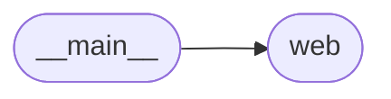
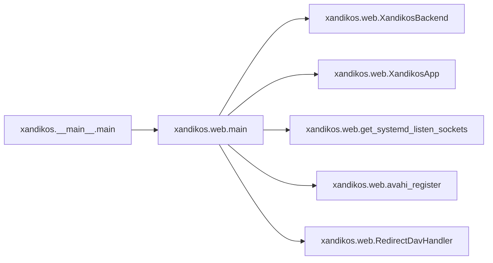

# Xandikos Main

[_Documentation generated by Documatic_](https://www.documatic.com)

<!---Documatic-section-Codebase Structure-start--->
## Codebase Structure

<!---Documatic-block-system_architecture-start--->

<!---Documatic-block-system_architecture-end--->

# #
<!---Documatic-section-Codebase Structure-end--->

<!---Documatic-section-xandikos.__main__.main-start--->
## xandikos.__main__.main

<!---Documatic-section-main-start--->


### Object Calls

* [xandikos.web.main](6-xandikos_web.md#xandikos.web.main)

<!---Documatic-block-xandikos.__main__.main-start--->
<details>
	<summary><code>xandikos.__main__.main</code> code snippet</summary>

```python
def main(argv: List[str]):
    from .web import main
    return main(argv)
```
</details>
<!---Documatic-block-xandikos.__main__.main-end--->
<!---Documatic-section-main-end--->

# #
<!---Documatic-section-xandikos.__main__.main-end--->

[_Documentation generated by Documatic_](https://www.documatic.com)