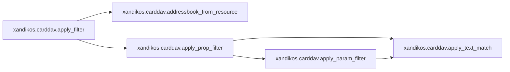
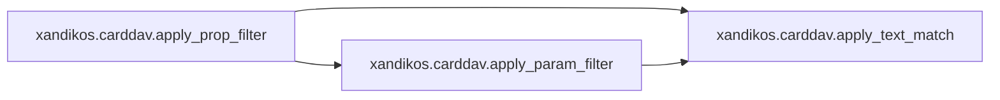

# Xandikos Carddav

[_Documentation generated by Documatic_](https://www.documatic.com)

<!---Documatic-section-Codebase Structure-start--->
## Codebase Structure

<!---Documatic-block-system_architecture-start--->
```mermaid
None
```
<!---Documatic-block-system_architecture-end--->

# #
<!---Documatic-section-Codebase Structure-end--->

<!---Documatic-section-xandikos.carddav.apply_filter-start--->
## [xandikos.carddav.apply_filter](4-xandikos_carddav.md#xandikos.carddav.apply_filter)

<!---Documatic-section-apply_filter-start--->


### Object Calls

* [xandikos.carddav.addressbook_from_resource](4-xandikos_carddav.md#xandikos.carddav.addressbook_from_resource)
* [xandikos.carddav.apply_prop_filter](4-xandikos_carddav.md#xandikos.carddav.apply_prop_filter)

<!---Documatic-block-xandikos.carddav.apply_filter-start--->
<details>
	<summary><code>xandikos.carddav.apply_filter</code> code snippet</summary>

```python
async def apply_filter(el, resource):
    if el is None or not list(el):
        return lambda x: True
    ab = await addressbook_from_resource(resource)
    if ab is None:
        return False
    test_name = el.get('test', 'anyof')
    test = {'allof': all, 'anyof': any}[test_name]
    return test((apply_prop_filter(subel, ab) for subel in el))
```
</details>
<!---Documatic-block-xandikos.carddav.apply_filter-end--->
<!---Documatic-section-apply_filter-end--->

# #
<!---Documatic-section-xandikos.carddav.apply_filter-end--->

<!---Documatic-section-xandikos.carddav.addressbook_from_resource-start--->
## [xandikos.carddav.addressbook_from_resource](4-xandikos_carddav.md#xandikos.carddav.addressbook_from_resource)

<!---Documatic-section-addressbook_from_resource-start--->
<!---Documatic-block-xandikos.carddav.addressbook_from_resource-start--->
<details>
	<summary><code>xandikos.carddav.addressbook_from_resource</code> code snippet</summary>

```python
async def addressbook_from_resource(resource):
    try:
        if resource.get_content_type() != 'text/vcard':
            return None
    except KeyError:
        return None
    file = await resource.get_file()
    return file.addressbook.contents
```
</details>
<!---Documatic-block-xandikos.carddav.addressbook_from_resource-end--->
<!---Documatic-section-addressbook_from_resource-end--->

# #
<!---Documatic-section-xandikos.carddav.addressbook_from_resource-end--->

<!---Documatic-section-xandikos.carddav.apply_prop_filter-start--->
## [xandikos.carddav.apply_prop_filter](4-xandikos_carddav.md#xandikos.carddav.apply_prop_filter)

<!---Documatic-section-apply_prop_filter-start--->


### Object Calls

* xandikos.carddav.apply_text_match
* xandikos.carddav.apply_param_filter

<!---Documatic-block-xandikos.carddav.apply_prop_filter-start--->
<details>
	<summary><code>xandikos.carddav.apply_prop_filter</code> code snippet</summary>

```python
def apply_prop_filter(el, ab):
    name = el.get('name').lower()
    if len(el) == 1 and el[0].tag == '{urn:ietf:params:xml:ns:carddav}is-not-defined':
        return name not in ab
    try:
        prop = ab[name]
    except KeyError:
        return False
    for prop_el in prop:
        matched = True
        for subel in el:
            if subel.tag == '{urn:ietf:params:xml:ns:carddav}text-match':
                if not apply_text_match(subel, str(prop_el)):
                    matched = False
                    break
            elif subel.tag == '{urn:ietf:params:xml:ns:carddav}param-filter':
                if not apply_param_filter(subel, prop_el):
                    matched = False
                    break
        if matched:
            return True
    return False
```
</details>
<!---Documatic-block-xandikos.carddav.apply_prop_filter-end--->
<!---Documatic-section-apply_prop_filter-end--->

# #
<!---Documatic-section-xandikos.carddav.apply_prop_filter-end--->

[_Documentation generated by Documatic_](https://www.documatic.com)