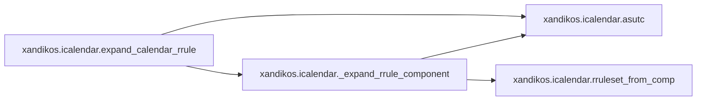
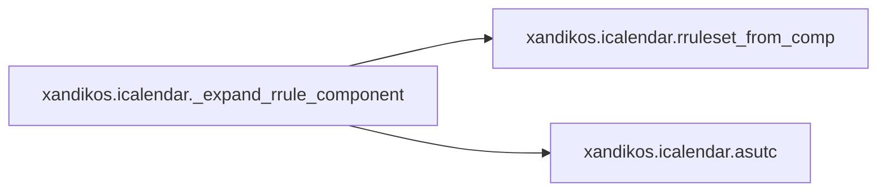

# Xandikos Icalendar

[_Documentation generated by Documatic_](https://www.documatic.com)

<!---Documatic-section-Codebase Structure-start--->
## Codebase Structure

<!---Documatic-block-system_architecture-start--->

<!---Documatic-block-system_architecture-end--->

# #
<!---Documatic-section-Codebase Structure-end--->

<!---Documatic-section-xandikos.icalendar.apply_time_range_vevent-start--->
## [xandikos.icalendar.apply_time_range_vevent](5-xandikos_icalendar.md#xandikos.icalendar.apply_time_range_vevent)

<!---Documatic-section-apply_time_range_vevent-start--->


### Object Calls

* [xandikos.icalendar.MissingProperty](5-xandikos_icalendar.md#xandikos.icalendar.MissingProperty)

<!---Documatic-block-xandikos.icalendar.apply_time_range_vevent-start--->
<details>
	<summary><code>xandikos.icalendar.apply_time_range_vevent</code> code snippet</summary>

```python
def apply_time_range_vevent(start, end, comp, tzify):
    dtstart = comp.get('DTSTART')
    if not dtstart:
        raise MissingProperty('DTSTART')
    if not end > tzify(dtstart.dt):
        return False
    dtend = comp.get('DTEND')
    if dtend:
        if tzify(dtend.dt) < tzify(dtstart.dt):
            logging.debug('Invalid DTEND < DTSTART')
        return start < tzify(dtend.dt)
    duration = comp.get('DURATION')
    if duration:
        return start < tzify(dtstart.dt) + duration.dt
    if getattr(dtstart.dt, 'time', None) is not None:
        return start <= tzify(dtstart.dt)
    else:
        return start < tzify(dtstart.dt) + datetime.timedelta(1)
```
</details>
<!---Documatic-block-xandikos.icalendar.apply_time_range_vevent-end--->
<!---Documatic-section-apply_time_range_vevent-end--->

# #
<!---Documatic-section-xandikos.icalendar.apply_time_range_vevent-end--->

<!---Documatic-section-xandikos.icalendar.as_tz_aware_ts-start--->
## [xandikos.icalendar.as_tz_aware_ts](5-xandikos_icalendar.md#xandikos.icalendar.as_tz_aware_ts)

<!---Documatic-section-as_tz_aware_ts-start--->
<!---Documatic-block-xandikos.icalendar.as_tz_aware_ts-start--->
<details>
	<summary><code>xandikos.icalendar.as_tz_aware_ts</code> code snippet</summary>

```python
def as_tz_aware_ts(dt, default_timezone):
    if not getattr(dt, 'time', None):
        dt = datetime.datetime.combine(dt, datetime.time())
    if dt.tzinfo is None:
        dt = dt.replace(tzinfo=default_timezone)
    assert dt.tzinfo
    return dt
```
</details>
<!---Documatic-block-xandikos.icalendar.as_tz_aware_ts-end--->
<!---Documatic-section-as_tz_aware_ts-end--->

# #
<!---Documatic-section-xandikos.icalendar.as_tz_aware_ts-end--->

<!---Documatic-section-xandikos.icalendar.expand_calendar_rrule-start--->
## [xandikos.icalendar.expand_calendar_rrule](5-xandikos_icalendar.md#xandikos.icalendar.expand_calendar_rrule)

<!---Documatic-section-expand_calendar_rrule-start--->


### Object Calls

* [xandikos.icalendar.asutc](5-xandikos_icalendar.md#xandikos.icalendar.asutc)
* [xandikos.icalendar._expand_rrule_component](5-xandikos_icalendar.md#xandikos.icalendar._expand_rrule_component)

<!---Documatic-block-xandikos.icalendar.expand_calendar_rrule-start--->
<details>
	<summary><code>xandikos.icalendar.expand_calendar_rrule</code> code snippet</summary>

```python
def expand_calendar_rrule(incal, start, end):
    outcal = Calendar()
    if incal.name != 'VCALENDAR':
        raise AssertionError('called on file with root component %s' % incal.name)
    for field in incal:
        outcal[field] = incal[field]
    known = {}
    for insub in incal.subcomponents:
        if 'RECURRENCE-ID' in insub:
            ts = insub['RECURRENCE-ID'].dt
            utcts = asutc(ts)
            known[utcts] = insub
    for insub in incal.subcomponents:
        if insub.name == 'VTIMEZONE':
            continue
        if 'RECURRENCE-ID' in insub:
            continue
        if 'RRULE' in insub:
            for outsub in _expand_rrule_component(insub, start, end, known):
                outcal.add_component(outsub)
        else:
            outcal.add_component(insub)
    return outcal
```
</details>
<!---Documatic-block-xandikos.icalendar.expand_calendar_rrule-end--->
<!---Documatic-section-expand_calendar_rrule-end--->

# #
<!---Documatic-section-xandikos.icalendar.expand_calendar_rrule-end--->

<!---Documatic-section-xandikos.icalendar.validate_calendar-start--->
## [xandikos.icalendar.validate_calendar](5-xandikos_icalendar.md#xandikos.icalendar.validate_calendar)

<!---Documatic-section-validate_calendar-start--->


### Object Calls

* [xandikos.icalendar.validate_component](5-xandikos_icalendar.md#xandikos.icalendar.validate_component)

<!---Documatic-block-xandikos.icalendar.validate_calendar-start--->
<details>
	<summary><code>xandikos.icalendar.validate_calendar</code> code snippet</summary>

```python
def validate_calendar(cal, strict=False):
    for error in validate_component(cal, strict=strict):
        yield error
```
</details>
<!---Documatic-block-xandikos.icalendar.validate_calendar-end--->
<!---Documatic-section-validate_calendar-end--->

# #
<!---Documatic-section-xandikos.icalendar.validate_calendar-end--->

<!---Documatic-section-xandikos.icalendar.MissingProperty-start--->
## [xandikos.icalendar.MissingProperty](5-xandikos_icalendar.md#xandikos.icalendar.MissingProperty)

<!---Documatic-section-MissingProperty-start--->
<!---Documatic-block-xandikos.icalendar.MissingProperty-start--->
<details>
	<summary><code>xandikos.icalendar.MissingProperty</code> code snippet</summary>

```python
class MissingProperty(Exception):

    def __init__(self, property_name):
        super(MissingProperty, self).__init__('Property %r missing' % property_name)
        self.property_name = property_name
```
</details>
<!---Documatic-block-xandikos.icalendar.MissingProperty-end--->
<!---Documatic-section-MissingProperty-end--->

# #
<!---Documatic-section-xandikos.icalendar.MissingProperty-end--->

<!---Documatic-section-xandikos.icalendar.asutc-start--->
## [xandikos.icalendar.asutc](5-xandikos_icalendar.md#xandikos.icalendar.asutc)

<!---Documatic-section-asutc-start--->
<!---Documatic-block-xandikos.icalendar.asutc-start--->
<details>
	<summary><code>xandikos.icalendar.asutc</code> code snippet</summary>

```python
def asutc(dt):
    return dt.astimezone(pytz.utc).replace(tzinfo=None)
```
</details>
<!---Documatic-block-xandikos.icalendar.asutc-end--->
<!---Documatic-section-asutc-end--->

# #
<!---Documatic-section-xandikos.icalendar.asutc-end--->

<!---Documatic-section-xandikos.icalendar.validate_component-start--->
## [xandikos.icalendar.validate_component](5-xandikos_icalendar.md#xandikos.icalendar.validate_component)

<!---Documatic-section-validate_component-start--->
<!---Documatic-block-xandikos.icalendar.validate_component-start--->
<details>
	<summary><code>xandikos.icalendar.validate_component</code> code snippet</summary>

```python
def validate_component(comp, strict=False):
    for (name, value) in comp.items():
        if isinstance(value, vText):
            for c in _INVALID_CONTROL_CHARACTERS:
                if c in value:
                    yield ('Invalid character %s in field %s' % (c.encode('unicode_escape'), name))
    if strict:
        for required in comp.required:
            try:
                comp[required]
            except KeyError:
                yield ('Missing required field %s' % required)
    for subcomp in comp.subcomponents:
        for error in validate_component(subcomp, strict=strict):
            yield error
```
</details>
<!---Documatic-block-xandikos.icalendar.validate_component-end--->
<!---Documatic-section-validate_component-end--->

# #
<!---Documatic-section-xandikos.icalendar.validate_component-end--->

<!---Documatic-section-xandikos.icalendar._expand_rrule_component-start--->
## [xandikos.icalendar._expand_rrule_component](5-xandikos_icalendar.md#xandikos.icalendar._expand_rrule_component)

<!---Documatic-section-_expand_rrule_component-start--->


### Object Calls

* xandikos.icalendar.rruleset_from_comp
* [xandikos.icalendar.asutc](5-xandikos_icalendar.md#xandikos.icalendar.asutc)

<!---Documatic-block-xandikos.icalendar._expand_rrule_component-start--->
<details>
	<summary><code>xandikos.icalendar._expand_rrule_component</code> code snippet</summary>

```python
def _expand_rrule_component(incomp, start, end, existing):
    rs = rruleset_from_comp(incomp)
    for field in ['RRULE', 'EXRULE', 'UNTIL', 'RDATE', 'EXDATE']:
        if field in incomp:
            del incomp[field]
    for ts in rs.between(start, end):
        utcts = asutc(ts)
        try:
            outcomp = existing.pop(utcts)
            outcomp['DTSTART'] = vDatetime(asutc(outcomp['DTSTART'].dt))
        except KeyError:
            outcomp = incomp.copy()
            outcomp['DTSTART'] = vDatetime(utcts)
        outcomp['RECURRENCE-ID'] = vDatetime(utcts)
        yield outcomp
```
</details>
<!---Documatic-block-xandikos.icalendar._expand_rrule_component-end--->
<!---Documatic-section-_expand_rrule_component-end--->

# #
<!---Documatic-section-xandikos.icalendar._expand_rrule_component-end--->

[_Documentation generated by Documatic_](https://www.documatic.com)