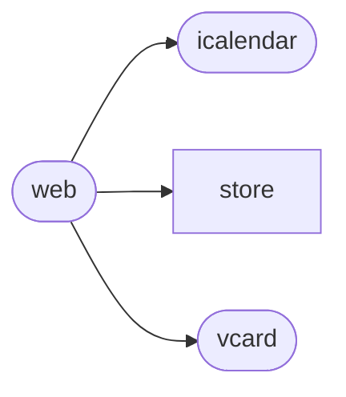
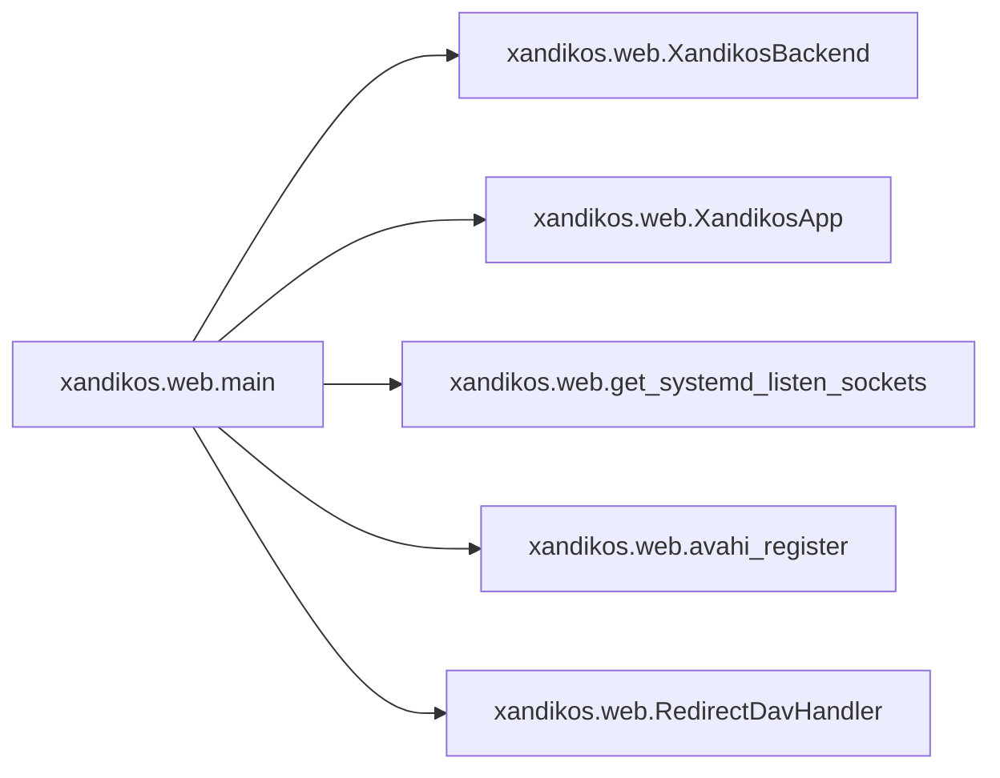

# Xandikos Web

[_Documentation generated by Documatic_](https://www.documatic.com)

<!---Documatic-section-Codebase Structure-start--->
## Codebase Structure

<!---Documatic-block-system_architecture-start--->

<!---Documatic-block-system_architecture-end--->

# #
<!---Documatic-section-Codebase Structure-end--->

<!---Documatic-section-xandikos.web.main-start--->
## [xandikos.web.main](6-xandikos_web.md#xandikos.web.main)

<!---Documatic-section-main-start--->


### Object Calls

* [xandikos.web.XandikosBackend](6-xandikos_web.md#xandikos.web.XandikosBackend)
* [xandikos.web.XandikosApp](6-xandikos_web.md#xandikos.web.XandikosApp)
* [xandikos.web.get_systemd_listen_sockets](6-xandikos_web.md#xandikos.web.get_systemd_listen_sockets)
* [xandikos.web.avahi_register](6-xandikos_web.md#xandikos.web.avahi_register)
* [xandikos.web.RedirectDavHandler](6-xandikos_web.md#xandikos.web.RedirectDavHandler)

<!---Documatic-block-xandikos.web.main-start--->
<details>
	<summary><code>xandikos.web.main</code> code snippet</summary>

```python
def main(argv=None):
    import argparse
    import sys
    from xandikos import __version__
    parser = argparse.ArgumentParser(usage='%(prog)s -d ROOT-DIR [OPTIONS]')
    parser.add_argument('--version', action='version', version='%(prog)s ' + '.'.join(map(str, __version__)))
    access_group = parser.add_argument_group(title='Access Options')
    if systemd_imported:
        access_group.add_argument('--no-detect-systemd', action='store_false', dest='detect_systemd', help='Disable systemd detection and socket activation.')
    access_group.add_argument('-l', '--listen-address', dest='listen_address', default='localhost', help='Bind to this address. Pass in path for unix domain socket. [%(default)s]')
    access_group.add_argument('-p', '--port', dest='port', type=int, default=8080, help='Port to listen on. [%(default)s]')
    access_group.add_argument('--route-prefix', default='/', help='Path to Xandikos. (useful when Xandikos is behind a reverse proxy) [%(default)s]')
    parser.add_argument('-d', '--directory', dest='directory', default=None, help='Directory to serve from.')
    parser.add_argument('--current-user-principal', default='/user/', help='Path to current user principal. [%(default)s]')
    parser.add_argument('--autocreate', action='store_true', dest='autocreate', help='Automatically create necessary directories.')
    parser.add_argument('--defaults', action='store_true', dest='defaults', help='Create initial calendar and address book. Implies --autocreate.')
    parser.add_argument('--dump-dav-xml', action='store_true', dest='dump_dav_xml', help='Print DAV XML request/responses.')
    parser.add_argument('--avahi', action='store_true', help='Announce services with avahi.')
    parser.add_argument('--no-strict', action='store_false', dest='strict', help='Enable workarounds for buggy CalDAV/CardDAV client implementations.', default=True)
    parser.add_argument('--debug', action='store_true', help='Print debug messages')
    options = parser.parse_args(argv)
    if options.directory is None:
        parser.print_usage()
        sys.exit(1)
    if options.dump_dav_xml:
        os.environ['XANDIKOS_DUMP_DAV_XML'] = '1'
    if not options.route_prefix.endswith('/'):
        options.route_prefix += '/'
    if options.debug:
        loglevel = logging.DEBUG
    else:
        loglevel = logging.INFO
    logging.basicConfig(level=loglevel, format='%(message)s')
    backend = XandikosBackend(os.path.abspath(options.directory))
    backend._mark_as_principal(options.current_user_principal)
    if options.autocreate or options.defaults:
        if not os.path.isdir(options.directory):
            os.makedirs(options.directory)
        backend.create_principal(options.current_user_principal, create_defaults=options.defaults)
    if not os.path.isdir(options.directory):
        logging.warning('%r does not exist. Run xandikos with --autocreate?', options.directory)
    if not backend.get_resource(options.current_user_principal):
        logging.warning('default user principal %s does not exist. Run xandikos with --autocreate?', options.current_user_principal)
    main_app = XandikosApp(backend, current_user_principal=options.current_user_principal, strict=options.strict)

    async def xandikos_handler(request):
        return await main_app.aiohttp_handler(request, options.route_prefix)
    if getattr(options, 'detect_systemd', False) and systemd.daemon.booted():
        listen_socks = get_systemd_listen_sockets()
        socket_path = None
        listen_address = None
        listen_port = None
        logging.info('Receiving file descriptors from systemd socket activation')
    elif '/' in options.listen_address:
        socket_path = options.listen_address
        listen_address = None
        listen_port = None
        listen_socks = []
        logging.info('Listening on unix domain socket %s', socket_path)
    else:
        listen_address = options.listen_address
        listen_port = options.port
        socket_path = None
        listen_socks = []
        logging.info('Listening on %s:%s', listen_address, options.port)
    from aiohttp import web
    app = web.Application()
    try:
        from aiohttp_openmetrics import setup_metrics
    except ModuleNotFoundError:
        logging.warning('aiohttp-openmetrics not found; /metrics will not be available.')
    else:
        setup_metrics(app)
    app.router.add_get('/health', lambda r: web.Response(text='ok'))
    for path in WELLKNOWN_DAV_PATHS:
        app.router.add_route('*', path, RedirectDavHandler(options.route_prefix).__call__)
    if options.route_prefix.strip('/'):
        xandikos_app = web.Application()
        xandikos_app.router.add_route('*', '/{path_info:.*}', xandikos_handler)

        async def redirect_to_subprefix(request):
            return web.HTTPFound(options.route_prefix)
        app.router.add_route('*', '/', redirect_to_subprefix)
        app.add_subapp(options.route_prefix, xandikos_app)
    else:
        app.router.add_route('*', '/{path_info:.*}', xandikos_handler)
    if options.avahi:
        try:
            import avahi
            import dbus
        except ImportError:
            logging.error('Please install python-avahi and python-dbus for avahi support.')
        else:
            avahi_register(options.port, options.route_prefix)
    web.run_app(app, port=listen_port, host=listen_address, path=socket_path, sock=listen_socks)
```
</details>
<!---Documatic-block-xandikos.web.main-end--->
<!---Documatic-section-main-end--->

# #
<!---Documatic-section-xandikos.web.main-end--->

<!---Documatic-section-xandikos.web.avahi_register-start--->
## [xandikos.web.avahi_register](6-xandikos_web.md#xandikos.web.avahi_register)

<!---Documatic-section-avahi_register-start--->
<!---Documatic-block-xandikos.web.avahi_register-start--->
<details>
	<summary><code>xandikos.web.avahi_register</code> code snippet</summary>

```python
def avahi_register(port: int, path: str):
    import avahi
    import dbus
    bus = dbus.SystemBus()
    server = dbus.Interface(bus.get_object(avahi.DBUS_NAME, avahi.DBUS_PATH_SERVER), avahi.DBUS_INTERFACE_SERVER)
    group = dbus.Interface(bus.get_object(avahi.DBUS_NAME, server.EntryGroupNew()), avahi.DBUS_INTERFACE_ENTRY_GROUP)
    for service in ['_carddav._tcp', '_caldav._tcp']:
        try:
            group.AddService(avahi.IF_UNSPEC, avahi.PROTO_INET, 0, MDNS_NAME, service, '', '', port, avahi.string_array_to_txt_array(['path=%s' % path]))
        except dbus.DBusException as e:
            logging.error('Error registering %s: %s', service, e)
    group.Commit()
```
</details>
<!---Documatic-block-xandikos.web.avahi_register-end--->
<!---Documatic-section-avahi_register-end--->

# #
<!---Documatic-section-xandikos.web.avahi_register-end--->

<!---Documatic-section-xandikos.web.XandikosApp-start--->
## [xandikos.web.XandikosApp](6-xandikos_web.md#xandikos.web.XandikosApp)

<!---Documatic-section-XandikosApp-start--->
<!---Documatic-block-xandikos.web.XandikosApp-start--->
<details>
	<summary><code>xandikos.web.XandikosApp</code> code snippet</summary>

```python
class XandikosApp(webdav.WebDAVApp):

    def __init__(self, backend, current_user_principal, strict=True):
        super(XandikosApp, self).__init__(backend, strict=strict)

        def get_current_user_principal(env):
            try:
                return current_user_principal % env
            except KeyError:
                return None
        self.register_properties([webdav.ResourceTypeProperty(), webdav.CurrentUserPrincipalProperty(get_current_user_principal), webdav.PrincipalURLProperty(), webdav.DisplayNameProperty(), webdav.GetETagProperty(), webdav.GetContentTypeProperty(), webdav.GetContentLengthProperty(), webdav.GetContentLanguageProperty(), caldav.SourceProperty(), caldav.CalendarHomeSetProperty(), carddav.AddressbookHomeSetProperty(), caldav.CalendarDescriptionProperty(), caldav.CalendarColorProperty(), caldav.CalendarOrderProperty(), caldav.SupportedCalendarComponentSetProperty(), carddav.AddressbookDescriptionProperty(), carddav.PrincipalAddressProperty(), webdav.AppleGetCTagProperty(), webdav.DAVGetCTagProperty(), carddav.SupportedAddressDataProperty(), webdav.SupportedReportSetProperty(self.reporters), sync.SyncTokenProperty(), caldav.SupportedCalendarDataProperty(), caldav.CalendarTimezoneProperty(), caldav.MinDateTimeProperty(), caldav.MaxDateTimeProperty(), caldav.MaxResourceSizeProperty(), carddav.MaxResourceSizeProperty(), carddav.MaxImageSizeProperty(), access.CurrentUserPrivilegeSetProperty(), access.OwnerProperty(), webdav.CreationDateProperty(), webdav.SupportedLockProperty(), webdav.LockDiscoveryProperty(), infit.AddressbookColorProperty(), infit.SettingsProperty(), infit.HeaderValueProperty(), webdav.CommentProperty(), scheduling.CalendarUserAddressSetProperty(), scheduling.ScheduleInboxURLProperty(), scheduling.ScheduleOutboxURLProperty(), scheduling.CalendarUserTypeProperty(), scheduling.ScheduleTagProperty(), webdav.GetLastModifiedProperty(), timezones.TimezoneServiceSetProperty([]), webdav.AddMemberProperty(), caldav.ScheduleCalendarTransparencyProperty(), scheduling.ScheduleDefaultCalendarURLProperty(), caldav.MaxInstancesProperty(), caldav.MaxAttendeesPerInstanceProperty(), access.GroupMembershipProperty(), apache.ExecutableProperty(), caldav.CalendarProxyReadForProperty(), caldav.CalendarProxyWriteForProperty(), caldav.MaxAttachmentSizeProperty(), caldav.MaxAttachmentsPerResourceProperty(), caldav.ManagedAttachmentsServerURLProperty(), quota.QuotaAvailableBytesProperty(), quota.QuotaUsedBytesProperty(), webdav.RefreshRateProperty(), xmpp.XmppUriProperty(), xmpp.XmppServerProperty(), xmpp.XmppHeartbeatProperty()])
        self.register_reporters([caldav.CalendarMultiGetReporter(), caldav.CalendarQueryReporter(), carddav.AddressbookMultiGetReporter(), carddav.AddressbookQueryReporter(), webdav.ExpandPropertyReporter(), sync.SyncCollectionReporter(), caldav.FreeBusyQueryReporter()])
        self.register_methods([caldav.MkcalendarMethod()])
```
</details>
<!---Documatic-block-xandikos.web.XandikosApp-end--->
<!---Documatic-section-XandikosApp-end--->

# #
<!---Documatic-section-xandikos.web.XandikosApp-end--->

<!---Documatic-section-xandikos.web.RedirectDavHandler-start--->
## [xandikos.web.RedirectDavHandler](6-xandikos_web.md#xandikos.web.RedirectDavHandler)

<!---Documatic-section-RedirectDavHandler-start--->
<!---Documatic-block-xandikos.web.RedirectDavHandler-start--->
<details>
	<summary><code>xandikos.web.RedirectDavHandler</code> code snippet</summary>

```python
class RedirectDavHandler(object):

    def __init__(self, dav_root: str):
        self._dav_root = dav_root

    async def __call__(self, request):
        from aiohttp import web
        return web.HTTPFound(self._dav_root)
```
</details>
<!---Documatic-block-xandikos.web.RedirectDavHandler-end--->
<!---Documatic-section-RedirectDavHandler-end--->

# #
<!---Documatic-section-xandikos.web.RedirectDavHandler-end--->

<!---Documatic-section-xandikos.web.get_systemd_listen_sockets-start--->
## [xandikos.web.get_systemd_listen_sockets](6-xandikos_web.md#xandikos.web.get_systemd_listen_sockets)

<!---Documatic-section-get_systemd_listen_sockets-start--->
<!---Documatic-block-xandikos.web.get_systemd_listen_sockets-start--->
<details>
	<summary><code>xandikos.web.get_systemd_listen_sockets</code> code snippet</summary>

```python
def get_systemd_listen_sockets() -> List[socket.socket]:
    socks = []
    for fd in systemd.daemon.listen_fds():
        for family in (socket.AF_UNIX, socket.AF_INET, socket.AF_INET6):
            if systemd.daemon.is_socket(fd, family=family, type=socket.SOCK_STREAM, listening=True):
                sock = socket.fromfd(fd, family, socket.SOCK_STREAM)
                socks.append(sock)
                break
        else:
            raise RuntimeError('socket family must be AF_INET, AF_INET6, or AF_UNIX; socket type must be SOCK_STREAM; and it must be listening')
    return socks
```
</details>
<!---Documatic-block-xandikos.web.get_systemd_listen_sockets-end--->
<!---Documatic-section-get_systemd_listen_sockets-end--->

# #
<!---Documatic-section-xandikos.web.get_systemd_listen_sockets-end--->

<!---Documatic-section-xandikos.web.XandikosBackend-start--->
## [xandikos.web.XandikosBackend](6-xandikos_web.md#xandikos.web.XandikosBackend)

<!---Documatic-section-XandikosBackend-start--->
<!---Documatic-block-xandikos.web.XandikosBackend-start--->
<details>
	<summary><code>xandikos.web.XandikosBackend</code> code snippet</summary>

```python
class XandikosBackend(webdav.Backend):

    def __init__(self, path):
        self.path = path
        self._user_principals = set()

    def _map_to_file_path(self, relpath):
        return os.path.join(self.path, relpath.lstrip('/'))

    def _mark_as_principal(self, path):
        self._user_principals.add(posixpath.normpath(path))

    def create_collection(self, relpath):
        p = self._map_to_file_path(relpath)
        return Collection(self, relpath, TreeGitStore.create(p))

    def create_principal(self, relpath, create_defaults=False):
        principal = PrincipalBare.create(self, relpath)
        self._mark_as_principal(relpath)
        if create_defaults:
            create_principal_defaults(self, principal)

    def find_principals(self):
        """List all of the principals on this server."""
        return self._user_principals

    def get_resource(self, relpath):
        relpath = posixpath.normpath(relpath)
        if not relpath.startswith('/'):
            raise ValueError('relpath %r should start with /')
        if relpath == '/':
            return RootPage(self)
        p = self._map_to_file_path(relpath)
        if p is None:
            return None
        if os.path.isdir(p):
            try:
                store = open_store_from_path(p)
            except NotStoreError:
                if relpath in self._user_principals:
                    return PrincipalBare(self, relpath)
                return CollectionSetResource(self, relpath)
            else:
                return {STORE_TYPE_CALENDAR: CalendarCollection, STORE_TYPE_ADDRESSBOOK: AddressbookCollection, STORE_TYPE_PRINCIPAL: PrincipalCollection, STORE_TYPE_SCHEDULE_INBOX: ScheduleInbox, STORE_TYPE_SCHEDULE_OUTBOX: ScheduleOutbox, STORE_TYPE_SUBSCRIPTION: SubscriptionCollection, STORE_TYPE_OTHER: Collection}[store.get_type()](self, relpath, store)
        else:
            (basepath, name) = os.path.split(relpath)
            assert name != '', 'path is %r' % relpath
            store = self.get_resource(basepath)
            if store is None:
                return None
            if webdav.COLLECTION_RESOURCE_TYPE not in store.resource_types:
                return None
            try:
                return store.get_member(name)
            except KeyError:
                return None
```
</details>
<!---Documatic-block-xandikos.web.XandikosBackend-end--->
<!---Documatic-section-XandikosBackend-end--->

# #
<!---Documatic-section-xandikos.web.XandikosBackend-end--->

[_Documentation generated by Documatic_](https://www.documatic.com)